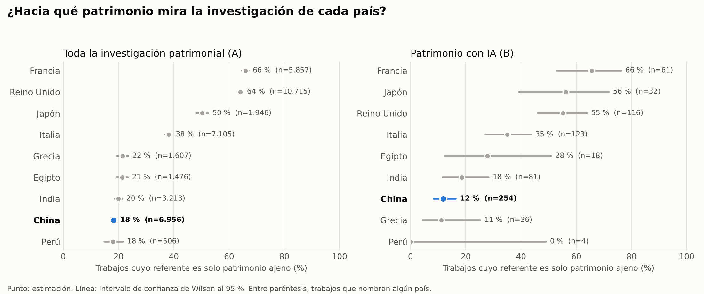
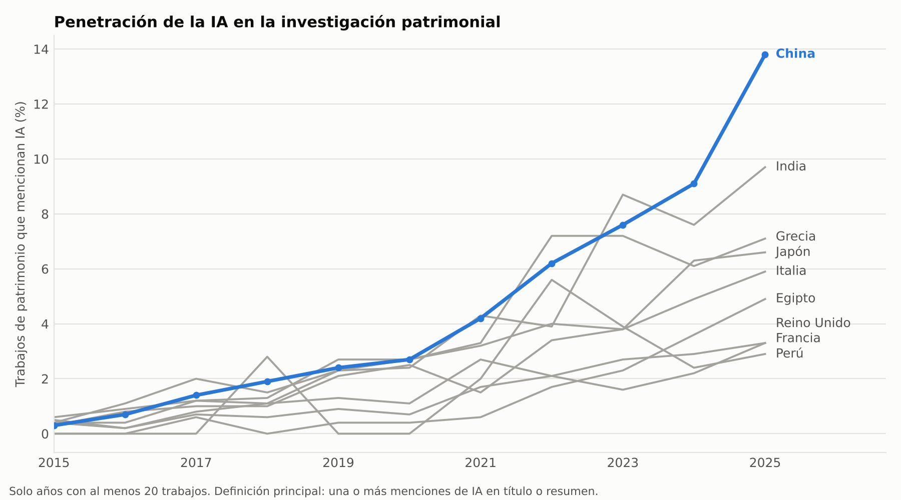
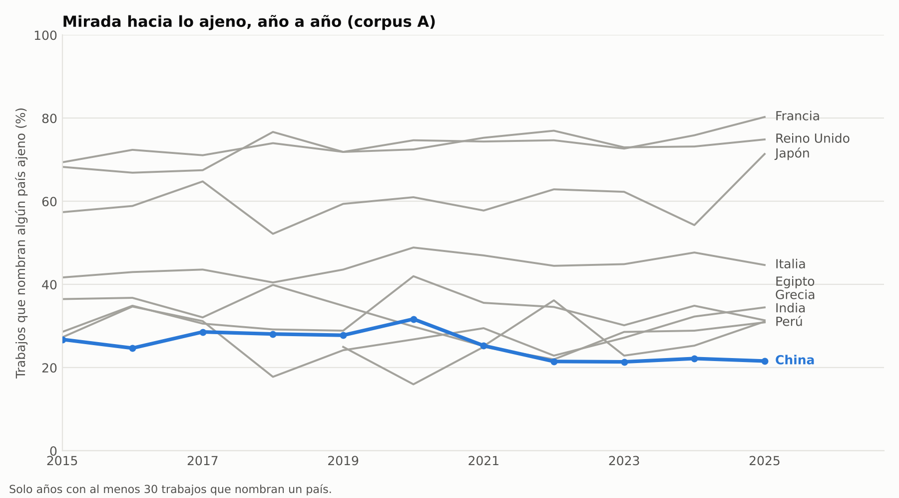
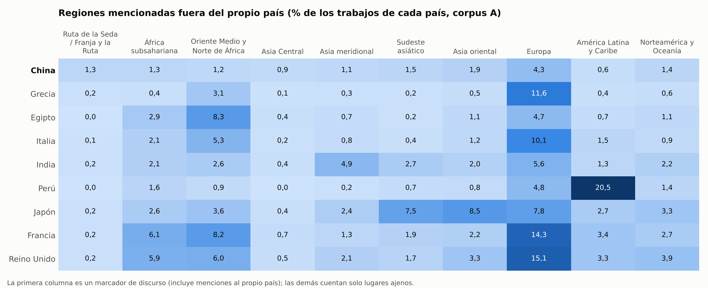
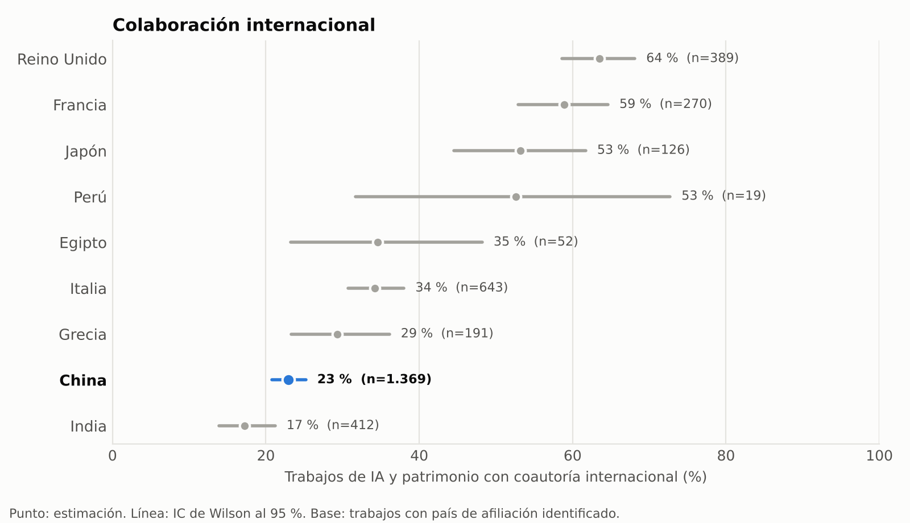

# IA, patrimonio cultural y agenda científica: un estudio bibliométrico comparado

**¿Qué hace diferente la investigación china sobre patrimonio e inteligencia artificial, vista desde el soft power?**

Este repositorio contiene los datos, el código y los resultados de un estudio que compara la
producción científica sobre patrimonio cultural, y la que aplica IA a ese patrimonio, en nueve
países. China es el caso de interés; los otros ocho son el punto de referencia sin el cual
ninguna cifra china se puede interpretar. Todos los corpus se descargan de OpenAlex con **la
misma consulta congelada** (`QUERY.txt`).

> **Versión 1.1** (octubre de 2026). Corrige la 1.0, retira una de sus afirmaciones y agrega el
> análisis de agenda. Ver [`CHANGELOG.md`](CHANGELOG.md).

---

## Resumen de resultados



1. **La IA ha penetrado más la investigación patrimonial china que la de casi cualquier otro
   país del conjunto.** El 7,5 % de los trabajos chinos sobre patrimonio menciona IA (IC 95 %:
   7,1–7,9), frente al 5,9 % de la India y entre el 1,4 % y el 4,2 % del resto. En 2025 es el
   13,8 %. El primer puesto depende de la definición: con al menos dos términos de IA, China y la
   India quedan en empate técnico (§ 2.1).
2. **La investigación china mira hacia adentro.** De los trabajos que nombran algún país, solo
   el 18 % (17–19 %) se refiere exclusivamente a patrimonio ajeno, frente al 64–66 % del Reino
   Unido y Francia. China comparte el extremo bajo con Perú, India, Egipto y Grecia, y queda en
   el último o penúltimo lugar bajo nueve definiciones distintas de «referente» (§ 2.2).
3. **No hay señal de que esa mirada se esté volviendo hacia afuera.** Entre 2015-2019 y
   2020-2025, la proporción de trabajos chinos que nombran un país ajeno bajó de 27 % a 23 %.
4. **El discurso de la Ruta de la Seda es mayormente doméstico.** Aparece en el 1,3 % de los
   trabajos chinos (en los demás países, en torno al 0,2 %), pero solo 10 de esos 245 trabajos se
   refieren exclusivamente a lugares ajenos (§ 2.4).
5. **China tiene baja colaboración internacional, pero no la más baja.** 23 % (21–25 %), por
   encima de la India (17 %). *La versión 1.0 afirmaba lo contrario; era un error* (§ 2.5).

Lo que estos datos **no** muestran es soft power. Muestran una agenda: a qué patrimonio dedica su
atención la ciencia de cada país. Si esa agenda es una vía de proyección es una pregunta que el
estudio acota, no responde (§ 1).

---

## 1. De qué trata y qué mide

El soft power, en el sentido de Joseph Nye, es la capacidad de un país de lograr lo que quiere
por atracción y no por coerción. No se observa directamente en una base bibliométrica. Lo que sí
se observa son **rastros que una hipótesis de soft power necesitaría**:

| Hipótesis de proyección | Rastro observable | Qué encontramos |
|---|---|---|
| China usa la IA patrimonial para **proyectar su mirada** sobre el patrimonio de otros (Ruta de la Seda, África) | alta proporción de trabajos sobre patrimonio ajeno | **No.** 18 %, entre los más bajos (§ 2.2) |
| China se convierte en **nodo** de redes internacionales | alta colaboración internacional | **No.** 23 %, entre las más bajas (§ 2.5) |
| China **exporta método**, no objetos | alta penetración de IA | **Sí, en volumen.** Lidera junto con la India (§ 2.1) |

Los resultados de las dos primeras filas son compatibles con una lectura alternativa: la IA
patrimonial china sería, sobre todo, una agenda de capacidad doméstica (documentar, restaurar y
gestionar el propio patrimonio con herramientas nuevas), no un instrumento de proyección
exterior. Esa lectura es una interpretación, no un resultado. Este diseño no puede distinguirla
de otras, por ejemplo que la proyección ocurra por otras vías (financiamiento, plataformas,
estándares, instituciones) que una base bibliométrica no ve.

La unidad de análisis es **el trabajo científico** (artículo, acta, capítulo...) indexado en
OpenAlex, atribuido a un país por la afiliación de **cualquiera** de sus autores.

---

## 2. Resultados

Todos los intervalos son de Wilson al 95 %. El periodo es 2015-2025 (2026 se excluye por ser un
año parcial). El corpus A suma 100.844 trabajos y el B (IA + patrimonio) 3.471, tras eliminar
195 duplicados.

### 2.1 Penetración de la IA



| País | Corpus A | Corpus B | Tasa de IA (B/A) | IC 95 % |
|---|---:|---:|---:|---|
| **China** | 18.326 | 1.369 | **7,5 %** | 7,1–7,9 |
| India | 6.957 | 412 | 5,9 % | 5,4–6,5 |
| Grecia | 4.528 | 191 | 4,2 % | 3,7–4,8 |
| Italia | 20.404 | 643 | 3,2 % | 2,9–3,4 |
| Japón | 4.117 | 126 | 3,1 % | 2,6–3,6 |
| Perú | 867 | 19 | 2,2 % | 1,4–3,4 |
| Egipto | 2.963 | 52 | 1,8 % | 1,3–2,3 |
| Francia | 15.264 | 270 | 1,8 % | 1,6–2,0 |
| Reino Unido | 27.418 | 389 | 1,4 % | 1,3–1,6 |

La divergencia es reciente: hasta 2020 todos los países estaban entre 0 % y 3 %. En China la tasa
pasa de 2,4 % (2019) a 13,8 % (2025; IC 12,8–14,8).

**Perfil técnico.** El aprendizaje profundo pesa más en la investigación asiática del conjunto
(`deep learning` aparece en el 30 % del corpus B chino, 36 % del indio y 41 % del japonés) que
en la europea (15–23 %). Ver `t3_tecnicas.csv`.

**Robustez.** `t1b_sensibilidad.csv` recalcula la tasa bajo siete definiciones. China es primera
en cinco: la principal, con 2026 incluido, solo con resumen, sin repositorios (Zenodo, Research
Square...) y solo artículos y actas. Pero **con dos o más términos distintos de IA** la India pasa
al primer lugar: 2,41 % (2,08–2,80) frente a 2,17 % (1,97–2,39) de China, un empate técnico. La
razón es que la definición principal incluye menciones de una sola palabra («convolutional»,
«neural network»), que son el 71 % del corpus B chino. Lo que se puede afirmar con seguridad es
que **China y la India están claramente por delante del resto**; que China esté primera depende
de cómo se defina «involucra IA».

### 2.2 Agenda: ¿patrimonio propio o ajeno?

Para cada trabajo se detectan los países que nombra en el título y el resumen, y se clasifica:

| Clase | Significado |
|---|---|
| **propio** | nombra solo el país del autor |
| **mixto** | nombra el propio y algún otro |
| **ajeno** | nombra otros países y no el propio |
| **sin referente** | no nombra ningún país (suele ser metodológico) |
| **especial** (solo China) | nombra únicamente Hong Kong, Macao o Taiwán |

La **métrica principal** es la proporción de trabajos *exclusivamente ajenos* entre los que
tienen referente. Se prefiere a «menciona algún ajeno» porque es menos sensible a menciones
incidentales: un trabajo chino sobre bambú tejido que cita una feria de Panamá en 1915 es
«mixto», pero no es un trabajo sobre Panamá.

Corpus A (todo el patrimonio):

| País | Trabajos con referente | **Exclusivamente ajeno** | IC 95 % | Menciona algún ajeno |
|---|---:|---:|---|---:|
| Francia | 5.857 | **65,9 %** | 64,7–67,1 | 73,5 % |
| Reino Unido | 10.715 | **64,1 %** | 63,2–65,0 | 73,4 % |
| Japón | 1.946 | **50,3 %** | 48,1–52,5 | 61,0 % |
| Italia | 7.105 | **38,1 %** | 36,9–39,2 | 45,0 % |
| Grecia | 1.607 | **21,5 %** | 19,5–23,5 | 33,0 % |
| Egipto | 1.476 | **21,3 %** | 19,3–23,4 | 28,1 % |
| India | 3.213 | **19,9 %** | 18,5–21,3 | 30,2 % |
| **China** | 6.956 | **18,2 %** | 17,3–19,1 | 24,0 % |
| Perú | 506 | **18,0 %** | 14,9–21,6 | 24,7 % |

Se distinguen **dos bloques**: Francia, Reino Unido, Japón e Italia estudian en buena medida el
patrimonio de otros; Grecia, Egipto, India, China y Perú se concentran en el propio. Dentro del
segundo bloque las diferencias son pequeñas y los intervalos se solapan (Perú y China son
estadísticamente indistinguibles). La afirmación sólida es de **bloque**, no de ranking.

En el corpus B (patrimonio con IA) China tiene 11,8 % (8,4–16,4 %; 254 trabajos con referente),
también entre los más bajos, pero los intervalos de todos los países son amplios (Grecia 11,1 %;
Perú, con 4 trabajos clasificables, no permite concluir nada).

**Robustez.** `t7f_sensibilidad.csv` repite el cálculo bajo nueve definiciones del referente:

| Definición | China (A) | Puesto de 9 |
|---|---:|---:|
| principal (nombres de país) | 18,2 % | 8.º |
| + gentilicios de los nueve países («Chinese», «Italian»...) | 14,8 % | 9.º |
| + sitios de la Lista UNESCO | 18,7 % | 9.º |
| + ciudades (GeoNames) | 18,5 % | 9.º |
| + sitios y ciudades | 18,5 % | 9.º |
| + gentilicios, sitios y ciudades (máxima recuperación; cobertura 59 %) | 15,9 % | 9.º |
| Hong Kong, Macao y Taiwán como propios | 17,8 % | 9.º |
| Hong Kong, Macao y Taiwán como ajenos | 19,6 % | 8.º |
| sin trabajos de tema principal en ciencias de la vida | 17,9 % | 9.º |

En todas China queda en el bloque bajo, en el 8.º o 9.º lugar. La conclusión no depende de la
definición, ni del tratamiento de Hong Kong, Macao y Taiwán, ni de la contaminación por
taxonomía de especímenes de museo (§ 5.2).

### 2.3 Evolución



Proporción de trabajos que nombran algún país ajeno (corpus A), 2015-2019 → 2020-2025:

| China | India | Egipto | Grecia | Perú | Italia | Japón | Reino Unido | Francia |
|---|---|---|---|---|---|---|---|---|
| 27,3 → **23,0** | 36,2 → 28,4 | 26,3 → 28,8 | 30,3 → 34,4 | 20,5 → 26,2 | 42,5 → 46,2 | 58,4 → 62,3 | 71,9 → 74,3 | 70,6 → 75,5 |

China y la India se vuelven más inward; los demás países, algo más outward. En el caso chino, el
gran aumento de volumen (de 1.627 a 5.329 trabajos con referente) no trajo más atención al
patrimonio ajeno.

### 2.4 Regiones y Ruta de la Seda



La hipótesis de que China mira hacia África o Asia Central **no** encuentra apoyo:

- **África subsahariana**: 1,3 % de los trabajos chinos (240), frente a 6,1 % de Francia (932) y
  5,9 % del Reino Unido (1.617).
- **Asia Central**: 0,9 %. **Sudeste asiático**: 1,5 %, frente a 7,5 % de Japón.
- La región extranjera más mencionada por China es **Europa** (4,3 %), no el Sur Global.

**Ruta de la Seda y Franja y la Ruta.** El marcador (`silk road`, `belt and road`, etc.) aparece
en 245 trabajos chinos (1,3 %; IC 1,2–1,5), contra 0,1–0,2 % en los demás países. Pero:

| Referente de esos 245 trabajos chinos | n |
|---|---:|
| propio (Dunhuang, Xinjiang...) | 118 |
| sin referente a ningún país | 94 |
| mixto | 21 |
| exclusivamente ajeno | 10 |
| solo Hong Kong, Macao o Taiwán | 2 |

En el Reino Unido, Francia e Italia el marcador acompaña, en su mayoría, a trabajos sobre lugares
ajenos (48 de 66, 16 de 28 y 18 de 24). **En China acompaña, sobre todo, a lugares chinos o a
ningún lugar.** Su frecuencia es estable entre 0,9 % y 1,5 % anual desde 2015, sin crecimiento
visible. En el corpus de IA solo hay 9 trabajos chinos con el marcador.

### 2.5 Colaboración internacional (corpus B)



China: **22,9 %** (20,8–25,2). La India es el país con menos: 17,2 % (13,9–21,2). Reino Unido
(63,5 %), Francia (58,9 %) y Japón (53,2 %) lideran. La versión 1.0 de este README afirmaba que
China tenía la colaboración más baja; era incorrecto con sus propios datos (`t1_panorama.csv`).

---

## 3. Qué contiene el repositorio

```
soft_power/
├── README.md, CHANGELOG.md
├── QUERY.txt                 la consulta congelada, con su fecha
├── requirements.txt
├── descarga_openalex.py      obtiene los corpus de la API de OpenAlex
├── comun.py                  carga, estadística, buscador de topónimos, estilo de figuras
├── analisis.py               panorama: tasa de IA, evolución, técnicas, venues, colaboración
├── agenda.py                 agenda: propio frente a ajeno, regiones, Ruta de la Seda
├── validacion.py             evalúa la precisión de la clasificación sobre una muestra
├── tests/test_gazetteer.py   falsos positivos conocidos del buscador
├── whc-sites-2025.xls        Lista del Patrimonio Mundial de la UNESCO
├── datos/                    corpus descargados (un archivo por país y nivel)
├── resultados/               tablas, figuras e informes
└── validacion/               revisión preliminar de la clasificación
```

Las tablas de `resultados/` están documentadas en el encabezado de `analisis.py` (t1 a t5) y de
`agenda.py` (t7). `datos/openalex_B_*.csv` son derivados de los `A` (los trabajos con al menos
un término de IA); el análisis los reconstruye desde A y no los lee.

---

## 4. Metodología

### 4.1 La descarga en dos pasos

La API se consulta solo por **patrimonio** (término específico, filtro liviano para el
servidor); el filtro de **IA** se aplica después, localmente, sobre título y resumen. Esto evita
la sintaxis booleana anidada, que es la parte más frágil de OpenAlex, y deja el criterio de
inclusión como código auditable y no como una cadena opaca en una URL.

- **Corpus A** (amplio): todo lo recuperado sobre patrimonio.
- **Corpus B** (IA + patrimonio): lo de A que menciona al menos uno de once términos de IA.
- **Tasa de IA = B / A.** Comparable entre países porque no depende del tamaño del sistema
  científico, aunque sí de la composición de A (§ 5.2).

El país es el de la afiliación de **cualquier** autor (`institutions.country_code`). Hong Kong,
Macao y Taiwán no se agrupan con China.

### 4.2 Qué es un «referente» (`agenda.py`)

El referente de un trabajo es el conjunto de **países cuyo nombre aparece como palabra completa**
en título y resumen. Un buscador por n-gramas (`comun.Gazetteer`) usa siempre la coincidencia
más larga: «South Korea» gana a «Korea», «Inner Mongolia» (provincia china) a «Mongolia».

Decisiones que conviene conocer:

- **Homónimos excluidos**: Georgia, Chad, Guinea, Níger, Jersey, Guernsey.
- **Hong Kong, Macao y Taiwán** son una categoría aparte para China (ni propios ni ajenos). Para
  los demás países son países como cualquier otro.
- **Departamentos de ultramar franceses** (Guadalupe, Martinica, Reunión...) cuentan como
  propios para Francia. Los territorios británicos de ultramar *no* cuentan como propios.
- **Sitios transfronterizos**: si el propio país es uno de los países del sitio, cuenta como
  propio y no como mixto.

Para el análisis de sensibilidad se agregan tres capas que aumentan la **recuperación**, es decir,
detectan lugares sin que el texto nombre el país:

| Capa | Fuente | Filtros contra el ruido |
|---|---|---|
| Gentilicios | nueve palabras (`Chinese`, `Italian`...) | solo para los nueve países focales |
| Sitios UNESCO | `whc-sites-2025.xls` (1.248 sitios, 3.831 variantes de nombre) | solo nombres en inglés y español; se descartan nombres de país y palabras sueltas asociadas a más de 3 países; regla de mayúscula; techo de frecuencia (1 %) |
| Ciudades | paquete `geonamescache` (ciudades de más de 50.000 habitantes) | solo nombre principal; los ambiguos entre países se descartan salvo que la mayor supere 200.000; regla de mayúscula; lista de nombres ruidosos |

**La regla de mayúscula** (`agenda.filtrar_ruidosos`) descarta una forma corta si en la mitad o
más de sus apariciones en resúmenes se escribe en minúscula. Un topónimo se escribe con
mayúscula; «palaces», «wetlands» o «reading» no. Se adapta al corpus en lugar de depender de
anticipar cada palabra problemática. Por eso mismo hay que revisar a mano las variantes más
frecuentes que sobreviven (la corrida las imprime).

### 4.3 Intervalos de confianza

Intervalos de Wilson al 95 %. Asumen que los trabajos son independientes. No lo son del todo
(un mismo grupo de autores publica varios trabajos similares), de modo que **los intervalos son
algo optimistas**, sobre todo en los países con corpus pequeños. Se interpretan como un mínimo
de incertidumbre, no como el total.

---

## 5. Validación y límites

Es la sección más importante para quien quiera citar estos resultados.

### 5.1 Validación de la clasificación

El emparejamiento de topónimos es heurístico. `agenda.py` escribe una muestra estratificada de
80 trabajos (`resultados/t7e_muestra_validacion.csv`, semilla 42) y `validacion.py evaluar`
calcula la precisión.

**Revisión preliminar** (`validacion/revision_preliminar_claude.csv`), hecha durante el
desarrollo de la v1.1 con asistencia de Claude (Anthropic), leyendo título, resumen y evidencia:

| | Resultado |
|---|---|
| **Precisión** de los países detectados | 55 de 55 correctos entre los decididos (IC 93,5–100 %); 5 ambiguos |
| **Recuperación** de los trabajos «sin referente» | **solo 6 de 17 decididos (35 %)** realmente no nombraban ningún lugar |

Es decir: cuando el buscador detecta un país, casi siempre acierta; pero **se le escapan más de
la mitad de los lugares que se nombran sin el país** (Marrakech, Dalian, Lefkada, Nunney). La
cobertura de 38 % que se informa para China es un **piso**, no una estimación del total. Las
capas de sitios y ciudades existen para medir cuánto cambia el resultado al recuperar más: la
cobertura sube hasta 59 % y la conclusión no se mueve (§ 2.2).

> **Pendiente**: esta revisión la hizo una sola persona, no independiente del diseño del
> buscador, y la muestra es pequeña. **No sustituye la validación humana** que el estudio
> necesita. `t7e_muestra_validacion.csv` está listo para etiquetar: rellenar `etiqueta_manual`
> (ok / error / ambiguo) y `fuera_de_tema`, y correr `python validacion.py evaluar`.

### 5.2 Otros límites

- **Menciona, no estudia.** El referente es lo que el título o resumen *nombra*. Una mención
  incidental cuenta, y un trabajo que estudia un lugar sin nombrarlo no. La métrica principal
  («exclusivamente ajeno») reduce el primer problema, no lo elimina.
- **Corpus contaminado por historia natural.** El término `museum` de la consulta atrae también
  la taxonomía de especímenes de museo (insectos, moluscos, fósiles). Una heurística por tópicos
  de OpenAlex la estima entre el 1,9 % (Egipto) y el 12,9 % (Japón) del corpus A, y entre 0 y 27
  trabajos por país en B. En la muestra revisada, el 15 % de los trabajos estaba fuera de tema.
  Quitarlos no cambia las conclusiones (§ 2.2), pero **la definición del corpus A debería
  refinarse** antes de publicar.
- **La tasa de IA depende del denominador.** El corpus A del Reino Unido incluye 1.719 registros
  del Archaeology Data Service y 1.947 informes; el de Italia, 700 de Zenodo. Parte de la baja
  tasa británica es composición del corpus, no menor uso de IA.
- **Resúmenes ausentes.** Entre el 13 % (Egipto) y el 27 % (Grecia) de los trabajos no tiene
  resumen, así que el filtro de IA solo ve el título y es más difícil que entren en B.
- **Los corpus nacionales se solapan.** Un artículo chino-británico está en los dos. En B, el
  6 % de lo chino aparece también en otro corpus, y el 31 % de lo japonés. Los países no son
  muestras independientes.
- **Sesgo idiomático.** OpenAlex indexa sobre todo en inglés. La literatura en chino (CNKI) no
  está, de modo que el corpus «chino» es lo que se publica hacia el exterior. Un trabajo chino
  sobre patrimonio africano publicado en chino no aparece.
- **Año parcial y fechas.** 2026 se excluye (14.128 trabajos). Los países se descargaron entre
  el 11 y el 17 de agosto de 2026 (`datos/log_descarga.csv`), y OpenAlex cambia a diario, de modo
  que las cifras no son de un mismo día. La fecha de `QUERY.txt` (28 de agosto) es posterior
  porque la v1.0 reescribía el archivo en cada ejecución: no es la fecha de descarga.
- **Corpus pequeños.** Perú (867 trabajos, 19 en B) y Egipto (52 en B) no permiten comparaciones
  finas. Los intervalos lo reflejan.
- **Afiliación como país.** Un investigador extranjero en una universidad china cuenta como
  China. No se distingue la nacionalidad del autor.

---

## 6. Cómo se ejecuta

Probado con Python 3.13, pandas 3.0 y matplotlib 3.11.

```bash
pip install -r requirements.txt
```

**Paso 1. Descargar los corpus** (solo si se parte de cero; los datos ya están en `datos/`).
Antes conviene comprobar que la consulta funciona contra la API:

```bash
python descarga_openalex.py --diagnostico
python descarga_openalex.py --todos                         # reanudable
python descarga_openalex.py --paises it gr eg --pausa 1.5   # si hay límite de tasa
```

`QUERY.txt` ya no se reescribe en cada ejecución. Si cambias los criterios sin subir
`VERSION_QUERY`, el script se niega a continuar.

**Paso 2. Analizar.**

```bash
python analisis.py                                  # unos 10 segundos
python agenda.py --unesco whc-sites-2025.xls        # 1-2 minutos
python tests/test_gazetteer.py                      # opcional
```

`analisis.py --anio-max 2026` incluye el año parcial. `agenda.py` sin `--unesco` omite la capa de
sitios (las variantes que la usan equivalen a la principal).

**Paso 3. Validar** (a mano, ver § 5.1).

```bash
python validacion.py evaluar
```

---

## 7. Pendientes

- [ ] **Validación humana independiente** de 50-80 clasificaciones (§ 5.1). Es el pendiente más
      importante.
- [ ] **Refinar el corpus A** para sacar la taxonomía de especímenes de museo, y volver a
      correr todo. Requiere una nueva versión de la consulta (`v2`) y redescargar los países.
- [ ] Descargar **Estados Unidos y España** para completar el conjunto de comparación.
- [ ] Una pasada con `--completo` para obtener financiamiento (`grants`, `funders`).
- [ ] **Una medida de redes**: quién colabora con quién, no solo cuánto. Es la otra mitad de la
      pregunta de soft power y hoy no está.
- [ ] Complementar con literatura en chino (CNKI) o, al menos, declarar su efecto.
- [ ] Medir en una muestra cuántos «sin referente» recupera la capa de ciudades.
- [ ] Reducir el peso del repositorio (§ 8).

---

## 8. Notas para quien reutilice esto

**Versiones.** Si se modifica la consulta, hay que subir `VERSION_QUERY` y volver a descargar
**todos** los países. Mezclar corpus obtenidos con consultas distintas invalida la comparación,
que es lo que sostiene el estudio.

**Peso.** `datos/` ocupa más de 300 MB y está versionado en git. Conviene sacarlo del control de
versiones y depositarlo en un repositorio de datos con identificador permanente (por ejemplo,
Zenodo):

```bash
git rm -r --cached datos/openalex_*.csv      # los archivos siguen en el disco
```

El historial de git conserva además un `.xlsx` de 5 MB de una versión anterior.

**Datos de terceros.** Los corpus provienen de [OpenAlex](https://openalex.org) (Priem, Piwowar y
Orr, 2022, arXiv:2205.01833). La Lista del Patrimonio Mundial es de la UNESCO. Revisar sus
condiciones de uso antes de redistribuir. El repositorio **no tiene todavía licencia**; conviene
agregar una antes de publicarlo.

**Cómo citar.** Pendiente de completar por los autores.
